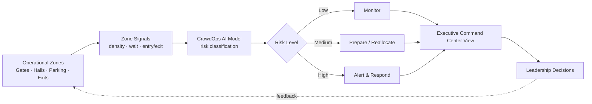
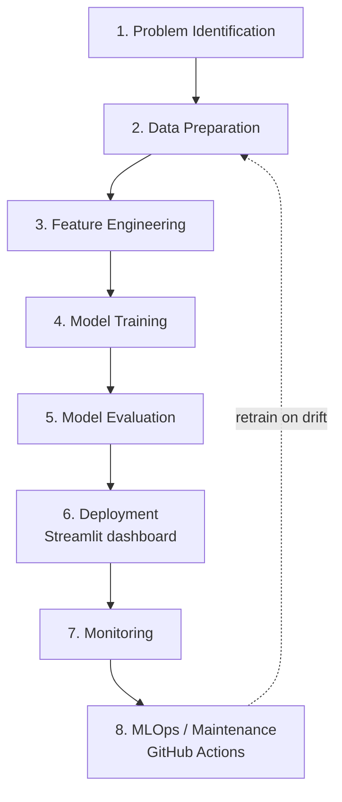

# Week 3 Visual Storytelling Kit

## Purpose

This kit turns the **CrowdOps AI Command Center** into a set of executive-ready
visuals. It gives you reusable diagrams, layouts, and image-generation prompts
so you can *show* — not just describe — how zone-level operational data becomes
crowd-risk intelligence and leadership decisions.

Use it to build slides, infographics, and dashboard mockups for an internal
presentation aimed at a COO or operations leadership audience.

## How This Fits AI Visuals & Photo Editing

Week 3 is about **visual storytelling and AI-assisted image creation**. This
project is an ideal subject because:

- It has a clear **before → after** narrative (raw data → clear decisions).
- It is **diagram-friendly** (a command-center loop and an AI lifecycle).
- It produces a **real dashboard** you can screenshot and polish.
- It carries an **executive message** that benefits from clean, minimal visuals.

The diagrams below are provided in **Mermaid** so they render directly in
GitHub/VS Code, and the prompts let you generate higher-fidelity infographics
with an AI image tool.

---

## Command Center Concept Diagram (Mermaid)

## AI Lifecycle Diagram (Mermaid)

---

## Dashboard Mockup Description

A single-screen command-center layout, left-to-right, top-to-bottom:

- **Top band — KPI cards (5):** Total Records · Operational Zones ·
  High-Risk Records · Avg Wait (min) · Model F1. Large numbers, small labels,
  calm blue-gray cards.
- **Left column — Zone Risk panel:** a horizontal bar chart of average density
  by zone, with High-risk zones tinted red.
- **Center — Risk Distribution:** a 3-bar chart (Low/Medium/High) in
  green/amber/red, with counts labelled.
- **Right column — Alerts feed:** a compact list of the highest-risk zones with
  a colored status dot.
- **Bottom — Prediction panel:** input fields on the left, a bold predicted
  risk badge and probability bars on the right.

Tone: minimal, professional, lots of whitespace, no clutter.

## Executive Infographic Layout

A one-page, three-row infographic:

1. **Row 1 — The Problem:** an icon row (gate, hall, parking, exit) with the
   line *"Risk builds across many zones at once."*
2. **Row 2 — The Engine:** a left-to-right arrow strip: *Signals → AI Model →
   Risk Level → Decision.* Each step a single icon + 3 words.
3. **Row 3 — The Payoff:** three outcome chips — *Faster response*, *Consistent
   risk signal*, *Clear leadership view* — plus a small "synthetic demo data"
   footnote.

Palette: corporate blue-gray (`#34607D`) with green/amber/red risk accents.

## Before / After Consulting Visual

| | **Before (Manual)** | **After (CrowdOps AI Command Center)** |
|---|---|---|
| **Visibility** | Scattered radios, spreadsheets, gut feel | One command-center view across all zones |
| **Risk signal** | Inconsistent, person-dependent | Consistent Low / Medium / High classification |
| **Speed** | Reactive, after incidents | Proactive, risk surfaced early |
| **Communication** | Hard to brief leadership quickly | Executive KPI cards + alerts at a glance |
| **Governance** | Undocumented decisions | Metrics, evaluation, monitoring on file |

> Visual idea: a split-screen — a cluttered "before" desk vs. a clean "after"
> dashboard — with a single arrow and the caption *"From noise to one clear
> risk signal."*

---

## Image-Generation Prompts

> Responsible-use note: these prompts generate **illustrative mockups** for an
> internal demo. Do not present generated images as real screenshots of a live
> production system, and keep the synthetic-data disclaimer visible.

### 1. Command center dashboard mockup

> "Create a dashboard mockup for a CrowdOps AI Command Center showing high-risk
> zones, crowd density, average waiting time, and operational alerts. Make it
> suitable for an executive presentation. Use a clean, modern, professional UI
> with a blue-gray corporate palette, clear KPI cards along the top, and
> green/amber/red risk indicators. Minimal text, lots of whitespace."

### 2. AI lifecycle infographic

> "Create a clean horizontal infographic showing the AI engineering lifecycle:
> Problem → Data → Features → Training → Evaluation → Deployment → Monitoring →
> MLOps. Use simple flat icons, numbered steps, a corporate blue-gray palette,
> and a subtle feedback loop arrow returning from Monitoring to Data."

### 3. Operational intelligence diagram

> "Create a professional consulting diagram of an operational command center
> loop: sense (zone signals) → reason (AI risk model) → surface (executive
> dashboard) → govern (monitoring). Use clean icons, directional arrows, and a
> minimal blue-gray corporate style suitable for a COO briefing."

### 4. Executive-ready visual summary

> "Create a clean executive infographic showing how a crowd operations command
> center converts zone-level data into risk alerts and leadership decisions.
> Use a professional consulting style, minimal text, clear icons, and a
> blue-gray corporate palette."

---

## Responsible AI Note for Visual Generation

- Label every generated image as an **illustrative mockup** of a **local,
  synthetic-data demo** — never as a live or real-client system.
- Do not fabricate logos, named clients, real venues, or real metrics in
  visuals.
- Keep risk colors intuitive (green/amber/red) but avoid implying guaranteed
  safety outcomes — the system is **decision support**, not an automated safety
  guarantee.
- When mixing AI-generated art with real dashboard screenshots, make the
  distinction obvious to the audience.
