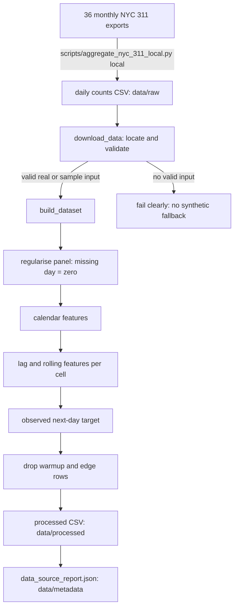
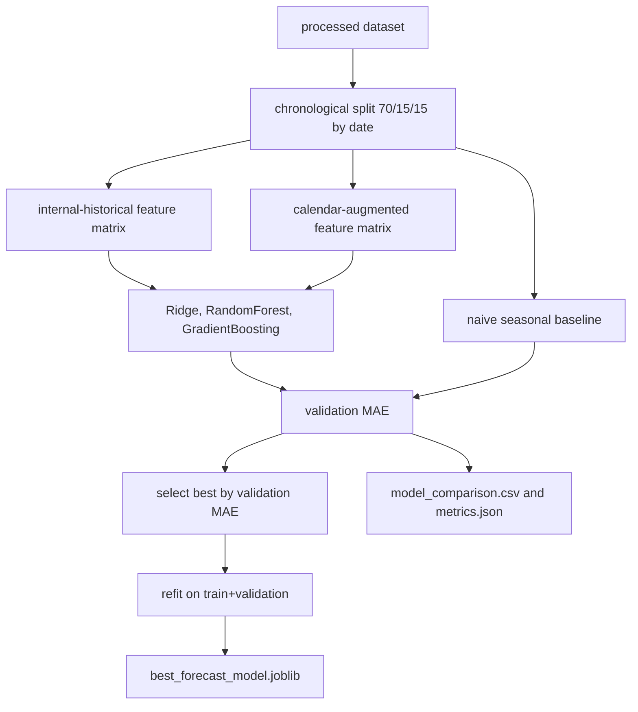
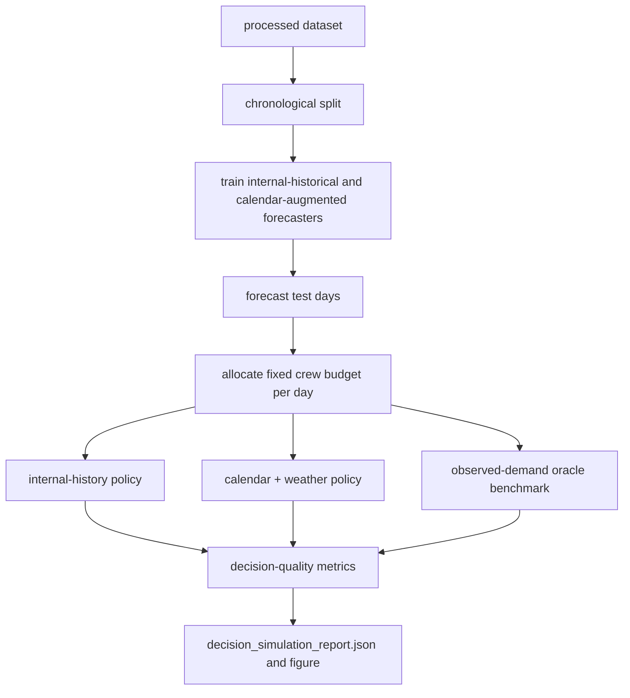
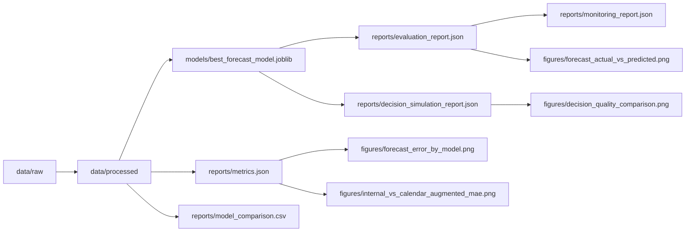

# Architecture

This document describes the components, pipelines, and output flow of the
Public Signal Service Forecasting baseline. The system is local-only and runs
end to end without external services once the real input data is present.

## Component overview

| Component | Module | Responsibility |
|-----------|--------|----------------|
| Configuration | `src/config.py` | Central constants: paths, domain values, complaint mapping, feature sets, split fractions, simulation parameters |
| Utilities | `src/utils.py` | Logging, JSON IO, directory setup, metric functions |
| Local aggregation | `scripts/aggregate_nyc_311_local.py` | Reduce the 36 monthly NYC 311 exports to observed daily counts (run locally) |
| Data location | `src/download_data.py` | Locate and validate the real daily-counts input; fail clearly if absent (no synthetic fallback) |
| Dataset build | `src/build_dataset.py` | Validate real input, regularise the panel, add calendar/lag/rolling features and the observed next-day target |
| Feature engineering | `src/features.py` | Feature-set definitions, calendar/holiday logic, leakage-safe lags, preprocessing |
| Training | `src/train.py` | Chronological split, model/feature-set comparison, model selection |
| Evaluation | `src/evaluate.py` | Held-out test metrics and comparison figures |
| Decision simulation | `src/decision_simulation.py` | Stylized staffing allocation and decision-quality metrics |
| Inference | `src/predict.py` | Single-record next-day volume prediction |
| Monitoring | `src/monitor.py` | Compares current model MAE to the naive baseline |
| Dashboard | `app.py` | Local Streamlit research dashboard |

## Data pipeline

## Modeling pipeline

## Decision simulation pipeline

## Output flow

## Execution order

The canonical end-to-end order is:

1. `python -m src.download_data` (locate and validate the real input)
2. `python -m src.build_dataset`
3. `python -m src.train`
4. `python -m src.evaluate`
5. `python -m src.decision_simulation`
6. `python -m src.monitor`

Each downstream module will build any missing upstream output automatically,
so individual commands can also be run in isolation. There is no synthetic
fallback: if no valid real input is present, the build fails with a specific
error.
